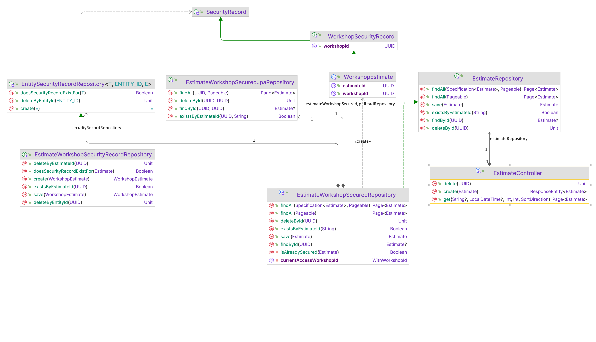

To ensure that no workshop accesses other workshop objects such as estimates etc.
interface called `EntitySecurityRecordRepository` is introduced. Meaning every repository from now on
should take care of fetching the right estimates and ensuring that just saved domain object is secured.

It will allow us build services, code which will stay security agnostic. Meaning that from domain code perspective,
calling `findAll()` on a repo will in fact return result containg of all objects but belonging to the currently
authenticated `access`, workshop.

Example implementation for estimates repositories

It is current approach of how we ensure cross workshop security. It is expected it to evolve. It even might be replaced
when switching back to microservices.

If some abstraction over this approach will change, such as `EntitySecurityRecordRepository` or `SecuirtyRecord`, please produce another ADR.
